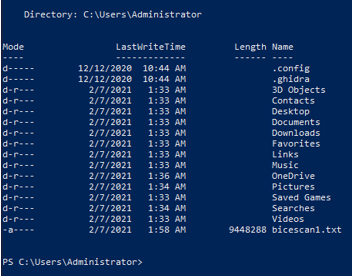
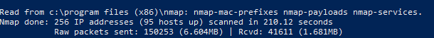
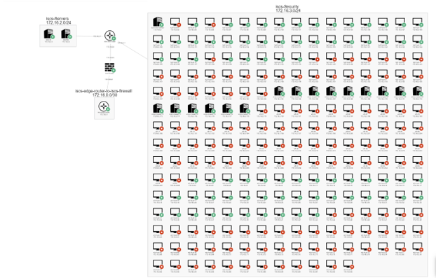
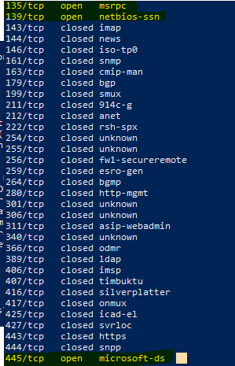
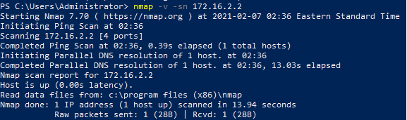
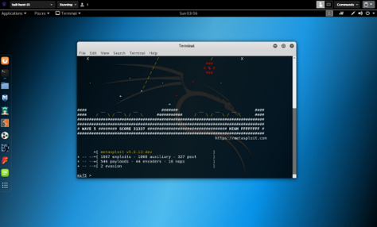
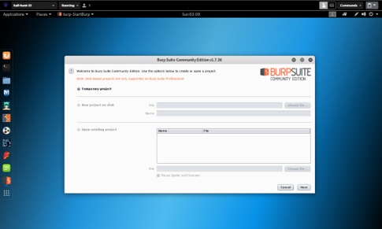
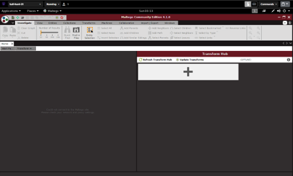

# Accessing SimSpace, Exploring the Virtual Network,and Accessing the win-hunt-10 Virtual Machine 

## Introduction

SimSpace is a service that is used for conducting simulations of cyber warfare and training cyber security students. This lab introduces SimSpace and gives instruction over a few of the various ways one can interface with virtual machines. Most of the lab is interacting with a Windows virtual machine and running network scans with basic parameters followed by analysis of the results. The lab then concludes with running a Kali Linux virtual machine and executing three of its installed cyber security applications.

## Opening SimSpace and Accessing the Virtual Machine

I begin this lab by logging into SimSpace and familiarizing myself with its user interface. I read over the guide a few times in order to have a better understanding of the program. In this case, my only concern was the “events” pane. From there, I navigated under the “live action events panel” since this event is intended to be interactive. After selecting my course’s class range under the “virtual machines” tab, I was given a large list of all the virtual machines that were running in the network. After some scrolling, I found the virtual machines running windows, which are named with the convention “win-hunt-##,” were located nearer to the bottom of the list.

Before I began launching the Windows virtual machine, I noticed that the lab instructions did not specify a specific machine that was to be used. Therefore, I arbitrarily chose the machine win-hunt-10. Using the provided password, I logged into the machine and waited for it to take me to the desktop. Once everything had loaded up, I was then ready to open a PowerShell window and begin my scans with Nmap.

## Interfacing with the win-hunt-10 Virtual Machine and Running the First Nmap Scan

Through the start menu, I located PowerShell. According to Microsoft’s official website, PowerShell is a cross-platform task automation and configuration management framework that utilizes the command line and is built with the .NET Common Language Runtime in mind (PowerShell Overview). As such, this software is a suitable platform for running Nmap. Upon opening the command prompt, I type in the command “nmap” and hit enter. The console then returns a whole array of information that includes target specification, host discovery, scan techniques, port specification and scan order, service/version detection, script scan, OS detection, timing and performance, firewall/IDS evasion and spoofing, output, miscellaneous, and examples. A quick run-through of the information reveals that this is a command list, and all the entries are ways Nmap can be used and manipulated. For this lab, I am only focused on commands under host discovery, scan techniques, and output. With my commands laid out before me, I am now ready to begin the first scan.

I initiate the first scan by typing “nmap -v 172.16.3.0/24.” Based on the information given from the “nmap” command, this iteration of “nmap” initiates the scan while the “-v” command increases the verbosity level. That is, the verbosity level influences how much additional information is provided throughout the scan including side notes, the number of hosts and ports scanned, and whether each port is opened or closed (Command-line Flags). Lastly, based on the network map, the IP address at the end is concerned with the host for 236 IP addresses. Upon hitting enter, the scan begins.

Two things that are immediately apparent upon the conclusion of the scan is the length of time the scan took, and the amount of information it output. Based on the information at the end of the output, the scan took approximately three minutes and forty seconds. It appears to have swept through each of the IP addresses within the host subnet and given information about each one including its status and MAC address. As thorough and useful as that may be, I must suggest that this is not an efficient method for scanning data especially since the prompt froze and stuttered multiple times throughout the scan. I imagine that in a real-world setting, this period of inactivity would be a major cause of concern as information could potentially be outdated by the time the scan finishes. Moreover, the log is totally flooded with information that only clutters what the user is looking for. The other logs may be good to know, but they are not necessary and therefore only draw down the efficiency of scans. With only bearing this section of the lab in mind, I would think that running a scan with specific and concise parameters would be a far more suitable method for meeting the data analyst’s needs. Nevertheless, the information from the scan is not easily decipherable as there were vast amounts of logs that were spat out. In order to better understand the results of this scan, the directions of the lab suggest “piping” the output to a .txt file.

## Initiating the Second Scan and Analyzing the Output Text File

The second scan is initiated in a fashion similar to the first. The command for this scan was “nmap -v 172.16.3.0/24 > bicescan1.txt.” Like the first scan, the first half of this command will once again provide verbose information about every IP address it can ping within the host subnet. The second half, however, is what I assume “piping” to be. That is, using the prompt to automatically write the output of a command into an automatically generated .txt file. So, then, the output of the network scan will be written into a .txt file titled “bicescan1.txt.” Once again, I hit “enter” and commence the second scan. This time around, I noticed a large amount of information regarding “Nsock.” Security engineer Fotis Chantzis describes Nsock as a library of parallel sockets that acts as an abstraction layer and specializes in handling multiple sockets (sock_raw sic.). These are in place so that a more efficient means of generating input and output can be used.  In tandem with the piping command, the information about the scan is now stored in an easily accessible text file and I am now better able to analyze what, exactly, my machine just spat out at me.

With the second scan complete, the output has now been written to the text file. The lab suggests I still view this file within the PowerShell command prompt. Using the command “ls,” which tells the prompt to list the files within a given directory (MSQL Tips), I am able to see all the files under C:\Users\Administrator:

- <i>Figure 1</i>: The output the command prompt gives after typing the “ls” command. It displays all of the contents within the administrator directory in chronological order including the newly generated bicescan1.txt file which is found at the very bottom.

  

Now that I have located the directory in which my file is located, I can now use a command to view its contents.

With my target in sight, I type the command “cat bicescan1.txt.” The “cat” command is used to concatenate, or link, files together and print them as an output onto the command prompt (ShellHacks). After hitting “enter,” the output logs of the second scan are once again called forth. The final few entries in the scanning output explain that 256 IP addresses have been scanned in the 172.16.3.0/24 subnet and of those 256, 95 of the IP addresses are considered “up” or “running.” The figure below shows this snippet of the output:

- <i>Figure 2</i>: The final few lines of the scanning output. Points of interest include the number of IP addresses scanned and the number that are up. Also, and perhaps less significantly, this scan took approximately seven seconds longer.

  

To get a better understanding of what this means, we must refer to the network map and get a better look at this network’s structure.

## Evaluating the Network Map and Executing the UDP Nmap Scans

As mentioned, the network map shows the 172.16.3.0/24 host subnet with its individual IP addresses (however, contrary to what PowerShell states, I count only 236 addresses). But to go deeper, the entire network map must be observed:

- <i>Figure 3</i>: This is the network in which the lab is performed. From left to right and top to bottom, the servers, core router, firewall, edge router, and host subnet are shown. Also note the number of IP addresses that are offline. Further detail is given below.

  

The figure above reproduces the network map as it is seen in SimSpace. On the far left-hand side, there are two ISCS servers located under 172.16.2.0/24. This will be important to keep in mind for the other half of this section. Next, we see that this server address is linked to the ISCS core router. This core router is considered the center of the network as it joins all the parts together. To go down, we see that the ISCS core router is linked to the ISCS edge router. In between them, however, is the ISCS firewall which will ensure that no unwanted data will travel to or from the core router. Finally, on the right-hand side of the network map, we see the host subnet with all the IP addresses it connects. Among these is the win-hunt-10 virtual machine and the kali-hunt-31 terminal I will use in a later section. You will notice that there is a fairly even mix of IP addresses that are running (green) and stopped (red). As mentioned earlier, this diagram does line up with the output of the network scans as the IP addresses of the “running” hosts are the same ones the network scans consider to be “up.” With this information in mind, we can now look at what happens when we scan a server IP address.

We now begin the final scans of the lab. The first one uses the command “nmap -v -sU 172.16.2.2 > bicemachine10scan.txt.” This command is, for the most part, now familiar to us with the exception of two striking details: First, the IP address is no longer focused on the host subnet and is now using the IP address of the ISCS file server. Second, this command utilizes the “sU” switch which switches to a UDP scan instead of a TCP (Nmap, “UDP Scan”). This command, then, will send a UDP packet to every IP address that is associated with the server. Perhaps one of the more significant reasons for this change is the fact that UDP scans are faster (and more reckless) since they forgo error checking (Tutorialspoint). The main objective of this scan is to identify how many ports in the network are open. After running the scan, I scrolled through the section where it assesses the ports and checked the status of each one. I found that a vast majority of the ports were closed except for three: 135: msrpc, 139: netbios-ssn, and 445: microsoft-ds. The figure below shows this snippet of the output:

- <i>Figure 4</i>: Shown below is the section of the second scan that analyzes potential ports. Highlighted are ports 135, 139, and 445 which were all open. No other open ports appear throughout the remainder of the scan.

  

With these results in mind, we are now ready to compare them to the final scan.

The final scan utilizes the command “nmap -v -sn 172.16.2.2.” The “sn” option is used to disable port scanning after a host is discovered (Nmap, “Host Discovery”). In this regard, the scan is only concerned about discovering hosts and does not show the status of each individual TCP port. This appears to be a faster means of scanning for running hosts. Most noticeably was the fact that the output for this scan was considerably shorter since this scan was not concerned with the ports and their statuses. As for the results, they were overall in line with the previous scan:

- <i>Figure 5</i>: The final few logs of the final scanning process. Notice that the scanning process managed to find only one open host. As an aside, also note that, due to the nature of this scan, this is the fastest scan in the lab.

  

While taking the lab quiz, I noticed something that was rather unusual. The last quiz question asked how many ports were open for the UDP scan. The correct answer was, as I found, one. However, this does not agree with my findings during this lab. As seen in figure 4, the output’s list of ports clearly shows three open ports. My only other theory is that the question was referring to the number of hosts available, but I am uncertain if these terms are interchangeable. After deleting the bicescan1 and bicemachine10scan .txt files from the machine, I am then finished with the Windows portion of the virtual machine lab.

# Interfacing with the kali-hunt-31 Virtual Machine and Running Three Cyber Security Applications

The final section of the lab involves interacting with a wholly new piece of the subnet. Having finished with the Windows virtual machines, I then moved on to the Kali Linux virtual machines. Once again, the directions do not specify a specific kali terminal that is to be used. Therefore, I decided to randomly go with the kali-hunt-31 terminal. In a similar fashion, I used the provided username and password and logged on.

The directions of the lab then instruct me to choose three applications that would be useful to a security practitioner and run them. The programs that I chose were found in the toolbar to the left of the desktop. The first program I chose was Metasploit Framework. According to its official website, Metasploit is a security project that provides information about security vulnerabilities (Metasploit). No doubt this would be useful to a security analyst as this is essential information to know about any network. The figure below shows the Metasploit terminal after it has been opened:

- <i>Figure 6</i>: The terminal that pops up after Metasploit is initiated. This program is command-oriented, and all actions are taken through entries in the terminal.

  

The second program I decided to use is the eloquently named Burp Suite. This is a program that is famous for its web vulnerability scanning and penetration testing (Port Swigger). It is also a robust program with a modular structure such that the user can apply upgrades and updates as he or she sees fit (Delta Risk). Overall, this program is like Metasploit except for the fact that this program has its own GUI interface.

- <i>Figure 7</i>: The GUI interface of Burp Suite. The program functions by working through projects the user creates. Notice that this is the community edition which suggests the open-source nature of this program.

  

The third and final program for this lab is known as Maltego. To give a precise definition, Wikipedia states that Maltego is a software for open-source intelligence and forensics. It also provides a library of transforms from open sources and provides information in a graphical format. Once again, this program provides a GUI interface and seems to be the most complex of the three. It also has capabilities that extend beyond web vulnerability analysis and seems to be more focused on response and investigation.

- <i>Figure 8</i>: The interface of Maltego. This program has the most complex interface and is able to perform various functions regarding investigations and network monitoring. The picture shown here is of the free version.

  

These the programs are what I believe to be a few of the most essential ones for any security practitioner. Metasploit with its command terminal interface provides a sufficient method for quickly checking for any vulnerabilities. Building off this, Burp Suite can be useful as a more robust tool with a wider scope that can also scan for web vulnerabilities. Moreover, its modular and open-source nature gives it the potential to be one of the most useful and dynamic programs if the user is willing to keep working with it. Finally, in the event of any breaches, Maltego would be an excellent program to investigate. Its graphical display of data will make it easy for analysts to see what went wrong and choose the best course of action in the event of a security alert. Upon finishing the execution of these programs, the lab is brought to a close.

## Conclusion

Overall, I feel that this lab was a good introduction to SimSpace, its virtual machines and Nmap. Although it was not too difficult, it was still helpful to learn the ins and outs of these tools of cyber security training. The Windows portion especially provided some insight for properly using Nmap. This is information that I could potentially apply right now since I have attempted to use it in the past. Moreover, the Kali Linux provided a rather interesting outlook as to how a security practitioner’s desktop would look. Aside from some occasional speed bumps, the lab went smoothly, and I look forward to working with the next one.

# References

- <a href="https://www.tutorialspoint.com/difference-between-tcp-and-udp" target="_blank">(n.d.). Retrieved from tutorialspoint.com</a> 

- <a href="https://www.shellhacks.com/windows-cat-equivalent-cmd-powershell/" target="_blank">Admin. (2020, March 05). Windows: `Cat` Equivalent – CMD & PowerShell. Retrieved from shellhacks.com</a> 

- <a href="https://portswigger.net/burp" target="_blank">Burp Suite - Application Security Testing Software. (n.d.). Retrieved from portswinger.net</a> 

- <a href="https://sock-raw.org/nmap-ncrack/nsock" target="_blank">Chantzis, F. (n.d.). Nmap/Ncrack. Retrieved from sock-raw.org</a> 

- <a href="https://nmap.org/book/output-formats-commandline-flags" target="_blank">Command-line Flags: Nmap Network Scanning. (n.d.). Retrieved from nmap.org</a> 

- <a href="https://nmap.org/book/host-discovery-controls" target="_blank">Host Discovery Controls: Nmap Network Scanning. (n.d.). Retrieved from nmap.org</a> 

- <a href="https://deltarisk.com/blog/how-to-use-burp-suite-professional-for-web-application-security-part-one/" target="_blank">Huron, S. (2020, May 18). Burp Suite Professional for Web Application Security. Retrieved from deltarisk.com</a> 

- <a href="https://docs.microsoft.com/en-us/powershell/scripting/overview?view=powershell-7.1" target="_blank">Joeyaiello. (n.d.). What is PowerShell? - PowerShell. Retrieved from microsoft.com</a> 

- <a href="https://en.wikipedia.org/wiki/Maltego" target="_blank">Maltego. (2020, December 23). Retrieved from wikipedia.org</a> 

- <a href="https://www.mssqltips.com/sqlservertip/5058/using-powershell-to-work-with-directories-and-files/" target="_blank">Miner, J. (2017, August 31). Using PowerShell to Work with Directories and Files. Retrieved from mssqltips.com</a> 

- <a href="https://www.metasploit.com/" target="_blank">Penetration Testing Software, Pen Testing Security. (n.d.). Retrieved from metasploit.com</a> 

- <a href="https://nmap.org/book/scan-methods-udp-scan" target="_blank">UDP Scan (-sU): Nmap Network Scanning. (n.d.). Retrieved from nmap.org</a>

